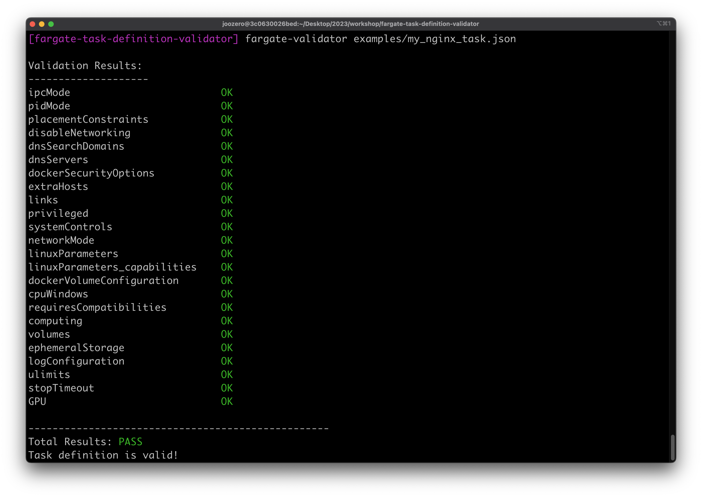

# Fargate Task Definition Validator


A simple utility to validate if a given AWS ECS task definition is compatible with Fargate.



## Installation
Clone the repository:
```
git clone https://github.com/joozero/fargate-task-definition-validator
```
Navigate to the project directory and install dependencies:
```
cd fargate-task-definition-validator
pip install .
```

## Usage

To validate a task definition:
```
fargate-validator examples/fail_task.json
```

## Testing

You can run tests with:
```
pytest
```

## Contributing
1. Fork the repository.
2. Create a new branch for your features or fixes.
3. Push your changes to your branch.
4. Create a Pull Request.

Feedback, issues, and contributions are always welcome!